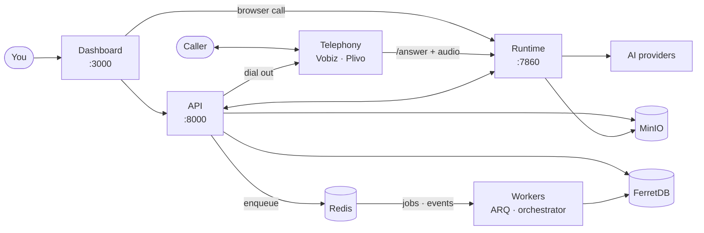

<div align="center">

# 🎙️ VoicEra

**Open-source, self-hosted voice AI for real-time telephony agents in Indian languages.**

*Your servers. Your call audio. Your rules.*

[](LICENSE)
[](https://www.python.org/downloads/)
[](docker-compose.yaml)
[](https://voicera.mintlify.app/docs/guides)
[](CONTRIBUTING.md)

[Quick start](#quick-start) · [Documentation](https://voicera.mintlify.app/docs/guides) · [Architecture](#architecture) · [Contributing](CONTRIBUTING.md)

</div>

---

VoicEra wires speech-to-text, large language models, text-to-speech, and telephony into one stack you run yourself, and gives you a REST API to drive it.

Use it for inbound helplines, outbound calling campaigns, and IVR replacements, without sending call audio anywhere outside infrastructure you control.

## 🚀 Quick start

```bash
git clone https://github.com/COSS-India/voicera.git
cd voicera

make application-up
```

`make application-up` creates `.env`, generates the required secrets, and starts the stack.

> [!IMPORTANT]
> Use `make application-up`, not a bare `docker compose up`. Three services refuse to start without a generated `SECRET_KEY`.

Once it is up:

| Service | URL |
| --- | --- |
| Dashboard | `localhost:3000` |
| API | `localhost:8000` |
| OpenAPI console | `localhost:8000/docs` |
| Runtime | `localhost:7860` |
| MinIO console | `localhost:9001` |
| FerretDB | `localhost:27018` |

Stop with `make application-down`.

## 🏗️ Architecture



Two services carry traffic: the **API** handles configuration and control, the **runtime** handles live audio. The **dashboard** is a browser client of both. Behind them sit FerretDB on PostgreSQL, Redis, MinIO, and two workers built from the API image.

Full picture: [Architecture](https://voicera.mintlify.app/docs/guides/concepts/architecture).

## 📚 Documentation

Live at [voicera.mintlify.app](https://voicera.mintlify.app/docs/guides), built with [Mintlify](https://mintlify.com) from [`docs/`](docs/) in this repo, navigation defined in [`docs.json`](docs.json).

## 🗂️ Repository layout

```text
voicera/
├── apps/
│   ├── api/            FastAPI — auth, agents, campaigns, knowledge   :8000
│   ├── runtime/        Pipecat — /answer webhook, call WebSocket      :7860
│   ├── providers/      STT · TTS · LLM registry — 23+ languages
│   └── telephony/      Vobiz · Plivo clients, answer XML, serializers
├── frontend/           Next.js dashboard — the web console            :3000
├── model-server/       Optional self-hosted models behind one gateway :8100
├── scripts/            start-application-services.sh · stop-application-services.sh
└── docs/               Mintlify source — guides · developer · api-reference
```

`apps/api` runs as **three** containers off one image: the API itself, an ARQ worker, and the campaign orchestrator. `apps/providers` and `apps/telephony` are libraries, imported by both services.

## 🔌 Extending VoicEra

Every vendor — AI provider, telephony carrier, or self-hosted model — is a new folder, never a patch to shared code.

| | |
| --- | --- |
| **Add an AI provider** | STT, TTS, or LLM vendor. New folder under `apps/providers/{cloud,adapters,local}/`, registers itself via decorator. [Guide](https://voicera.mintlify.app/docs/developer/guides/adding-a-provider) |
| **Add a telephony vendor** | New folder under `apps/telephony/providers/`, ten-module contract, both existing vendors (Vobiz, Plivo) as templates. [Guide](https://voicera.mintlify.app/docs/developer/guides/adding-a-telephony-provider) |
| **Run models locally** | Swap in self-hosted STT/TTS/LLM behind one gateway — one `.env` line per slot, no code change. [Model server](https://voicera.mintlify.app/docs/developer/model-server) |

## 🎒 What you need to bring

VoicEra provides neither telephony nor models.

- **Model credentials** — at least one STT, one TTS, and one LLM provider. One vendor can cover all three, or self-host with the [model server](https://voicera.mintlify.app/docs/developer/model-server).
- **A telephony account** — [Vobiz or Plivo](https://voicera.mintlify.app/docs/guides/concepts/telephony-model), for real phone calls. Not needed to test in a browser.

26 providers ship out of the box — 22 cloud vendors, two first-party adapters (Bhashini, Kenpath), and two local providers reached through the model server gateway (`indic_orpheus` TTS, `indic_nemotron` STT). See [Provider registry](https://voicera.mintlify.app/docs/developer/reference/provider-registry) for the full list.

## ✨ Why VoicEra

- **Call audio stays on infrastructure you control.** The runtime terminates the media stream, and recordings and transcripts land in your own MinIO bucket. Nothing routes through a VoicEra-operated service — there isn't one.
- **Indian languages are the design centre, not an afterthought.** The optional [model server](https://voicera.mintlify.app/docs/developer/model-server) runs AI4Bharat Indic Conformer and Indic-Transcribe for STT across 23+ Indian languages, and Indic Parler for TTS. The Bhashini (Dhruva STT and NVCF TTS) and Kenpath Vistaar (Marathi, Bhili LLM) adapters are built in.
- **Swap any provider without touching shared code.** STT, TTS, LLM, and telephony vendors all register through a decorator-based registry. See [Extending VoicEra](#extending-voicera).
- **Cloud or self-hosted, per slot.** Mix them: a cloud LLM with self-hosted Indic STT, or all three from one vendor. The choice is per agent, stored as configuration.
- **MIT, with no per-minute pricing.** You pay your model and telephony vendors directly. There is no seat count and no metered layer in between.

More questions: [operator FAQ](https://voicera.mintlify.app/docs/guides/operator/faq).

## ⚙️ Configuration

A single root `.env` file configures the API, the runtime, and the Docker stack — start from [`.env.example`](.env.example). The model server is configured separately, through its own `model-server/.env`.

See the full [environment variable reference](https://voicera.mintlify.app/docs/developer/reference/environment-variables) for every setting.

## 🤝 Contributing

Contributions are welcome. Please read [CONTRIBUTING.md](CONTRIBUTING.md) before opening a pull request.

There is no CI pipeline yet, so run the test suites locally first — see [Testing](https://voicera.mintlify.app/docs/developer/guides/testing) for all five. Found a security issue? Report it privately per [SECURITY.md](SECURITY.md) rather than opening a public issue.

## 📄 License

VoicEra is released under the [MIT License](LICENSE).

<div align="center">

*Built for the languages the rest of the industry treats as an afterthought.*

</div>
