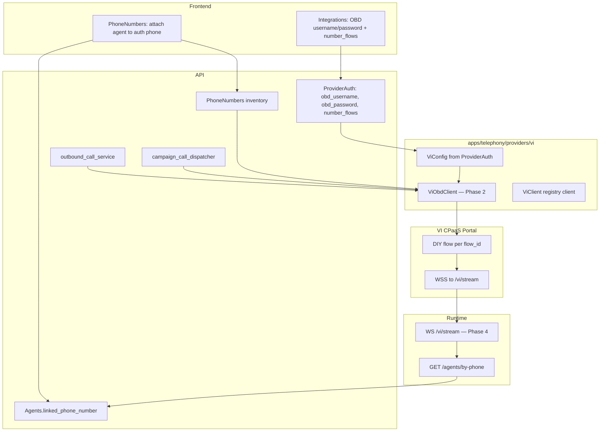

Vodafone Idea (VI) is a telephony provider that uses the VI CPaaS **OBD campaign API** for outbound dialing and a **direct WebSocket media path** for bidirectional audio. Unlike Vobiz and Plivo, VI has no per-agent carrier application or answer-webhook Stream XML hop.

This document is the single source of truth for the VI re-integration. Phase 1 registers `vi` in the telephony catalog; later phases wire OBD, API services, runtime WSS, and frontend UI.

## Architecture overview



**Key difference from Vobiz/Plivo:** One portal WSS URL (`wss://{VOICE_SERVER_BASE_URL}/vi/stream`) is configured once per DIY flow in the VI portal. VoicERA selects the agent at runtime from the DNI in the WebSocket `start` event.

## How VI differs from Vobiz/Plivo

| Aspect | Vobiz / Plivo | Vodafone Idea |
|--------|---------------|---------------|
| Org credentials | `ProviderAuth` via Integrations | Same (OBD username/password) |
| Carrier application | Created via REST API | Stub only — portal DIY flow |
| Inbound media | `/answer` → Stream XML → WSS | Direct WSS to `/vi/stream` |
| Outbound dial | REST `initiate_call` | OBD campaign API (1-row or bulk) |
| Number inventory | Carrier list API | Phones from Integrations `number_flows` |
| Number link API | Carrier `link_number` | Local DB only (portal DNI setup manual) |
| `flow_id` | N/A | Stored per phone in Integrations auth |

## Configuration model

### Org-level — ProviderAuth (`POST /auth`, provider=`vi`)

| Field | Storage | UI (Integrations) | Maps to |
|-------|---------|-------------------|---------|
| `obd_username` | Encrypted secret | OBD Username | VI `AuthToken` username |
| `obd_password` | Encrypted secret | OBD Password | VI `AuthToken` password |
| `number_flows` | Encrypted blob (non-secret field) | Repeatable phone + Flow ID rows | OBD `flowid` + DNI fallback per number |
| `base_url` | Non-secret default on `ViSettings` | Not in Integrations (platform default) | OBD API base |

VI does **not** use `auth_id` / `auth_token`. Credentials are **not** process environment variables.

Each `number_flows` entry:

| Sub-field | Purpose |
|-----------|---------|
| `phone_number` | DNI / caller ID (E.164, e.g. `+919769554706`) |
| `flow_id` | VI DIY flow id for OBD `createCampaign` / `getActiveDNIList` |

### PhoneNumbers attach

| Field | Purpose |
|-------|---------|
| `phone_number` | Must match one entry in Integrations `number_flows` |
| `provider` | `"vi"` |
| `agent_id` | Agent attached for routing + outbound caller ID |

**User flow:**

1. Integrations → Vodafone Idea → **OBD Username**, **OBD Password**, and one or more **phone + flow id** pairs.
2. Numbers → import/attach a phone from the auth-configured inventory.
3. Attach number to agent → sets `Agents.linked_phone_number`.
4. VI portal: each flow's WSS = `wss://host/vi/stream`; DNI matches the phone.

**Dial-time resolution:**

- Match agent's linked phone to `number_flows` → `flow_id` + DNI fallback.
- OBD: prefer live `getActiveDNIList(flow_id)`; fallback to configured phone number.

### Platform environment variables

These remain process env (not org-scoped). See [Environment variables](../reference/environment-variables.md#vodafone-idea-platform).

| Variable | Purpose |
|----------|---------|
| `VOICE_SERVER_BASE_URL` | Builds WSS URL for portal and provisioning |
| `VI_OBD_DIAL_TIMEOUT` | Default dial timeout for `createCampaign` (default 30) |
| `VI_OBD_STATUS_POLL_SECS` | Campaign status poll interval (default 30) |
| `VI_OBD_STATUS_POLL_MAX_ROUNDS` | Max poll rounds after bulk ingest (default 120; 0 disables) |
| `VI_DEFAULT_AGENT_ID` / `VI_DEFAULT_ORG_ID` | Runtime WSS fallback routing (Phase 4) |

## Telephony package layout

Phase 1 ships the catalog registration skeleton under `apps/telephony/providers/vi/`:

```
vi/
  config.py          # ViAuth + ViSettings + ViConfig (ProviderAuth-driven)
  client.py          # ViClient — thin facade over application + recording
  service.py         # @register_client, @register_answer_xml
  application.py     # initiate_call via OBD; list_numbers from auth inventory
  serializers.py     # ViFrameSerializer @ 8 kHz
  serializer_service.py
  xml.py             # Placeholder for registry symmetry
  recording.py       # Pipecat-only stub
  schemas.py
```

Phase 2 adds the modular OBD package:

```
obd/
  client.py        # ViObdClient — HTTP only, config-injected
  auth.py          # AuthToken + token cache
  campaign.py      # createCampaign, campaignstatus
  ingest.py        # staticCampaignDataIngestion
  dni.py           # getActiveDNIList, resolve_dni
  normalize.py     # normalize_msisdn, normalize_dni
routing.py         # resolve_vi_agent_id (runtime helper)
```

Design rules:

- `ViObdClient` is constructed with `(username, password, base_url)` — never reads env.
- `ViClient` holds `ViConfig`; OBD operations accept explicit `flow_id` and `dni` per call.
- No hardcoded `FLOW_ID` constant — `flow_id` always from Integrations auth `number_flows` (resolved at dial time by matching `from_number`).

## Portal setup

1. In the VI CPaaS portal, open the DIY flow matching the `flow_id` stored in Integrations auth.
2. Set the Streaming Object WebSocket URL to `wss://<VOICE_SERVER_HOST>/vi/stream`.
3. Ensure the flow DNI matches the phone number stored in VoicERA.
4. Repeat for each distinct `flow_id` / phone number pair.

## End-to-end flows (target state)

### A. Setup

1. Admin: Integrations → Vodafone Idea → username + password → `POST /auth`.
2. Admin: Numbers → Add → provider VI, pick phone from auth-configured inventory.
3. Admin: Attach number to telephony agent.
4. Ops: VI portal — flow WSS = `wss://host/vi/stream`, DNI matches phone.

### B. Inbound (Phase 4)

1. Call hits VI flow → WSS `wss://{VOICE_SERVER_BASE_URL}/vi/stream` with `start.dni`.
2. Runtime: `GET /agents/by-phone/{dni}` (10-digit DNI matches E.164 linked phone).
3. `create_inbound_call` → `run_telephony_bot(provider="vi")`.

### C. Outbound (test call / API) — Phase 3

1. `POST /calls/outbound` with `agent_id`, `to_number` only (not used for VoicERA CSV campaigns).
2. API loads org `ViConfig` via `load_telephony_client`; validates `from_number` against auth `number_flows`.
3. `initiate_call` resolves `flow_id` + DNI fallback → OBD: AuthToken → createCampaign → ingest **one** MSISDN (1-row mini campaign).
4. CallLog stores `campaign_Ref_ID` as `provider_call_sid`.
5. On answer: `/vi/stream` inbound routing by DNI.

### D. Campaign bulk (VoicERA CSV campaigns)

1. `campaign_call_dispatcher` detects `telephony.provider == "vi"` and claims up to 500 queued rows per batch.
2. **One** OBD `createCampaign` + `staticCampaignDataIngestion` bulk upload for the whole batch (`vi/campaign_dispatch.py`).
3. CallLogs are created locally per row; shared `campaign_Ref_ID` stored as `provider_call_sid`.
4. Status poll using `VI_OBD_STATUS_POLL_SECS` / `VI_OBD_STATUS_POLL_MAX_ROUNDS`.

## Open risks

- **Outbound agent re-resolution:** Media leg resolves agent by DNI, not outbound `agent_id`. Mitigation: unique linked DNI per agent until VI supports `custom_parameters.agent_id` in the start event.
- **Single org credential set:** All VI numbers in an org share OBD username/password (same as Vobiz/Plivo account model). Different flows are distinguished by per-number `flow_id`.
- **No carrier link API:** Attach remains local DB + manual portal DNI/flow setup.

## Phased rollout

| Phase | Scope |
|-------|--------|
| **1 — Foundation** | This doc, `flow_id` on API schemas, telephony catalog registration (stubs) |
| **2 — OBD package** | Modular `obd/` client, Integrations auth (`obd_username`, `obd_password`, `number_flows`), `initiate_call` wiring |
| **3 — API** | Outbound + campaign dial via `load_telephony_client`; attach validates phones against auth inventory |
| **4 — Runtime** | `WS /vi/stream`, agent-by-DNI routing via `GET /agents/by-phone` |
| **5 — Frontend** | VI Numbers inventory picker, wizard copy |

## Related

- [Adding a telephony provider](adding-a-telephony-provider.md)
- [Environment variables](../reference/environment-variables.md)
- [Telephony model](../../guides/concepts/telephony-model)
